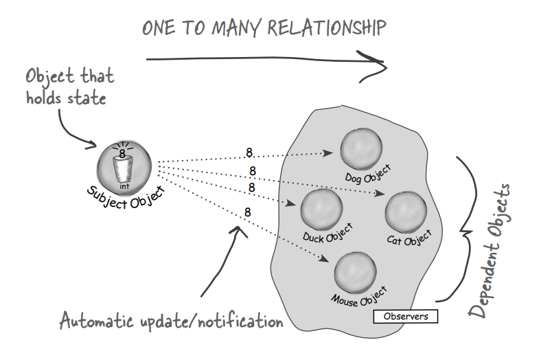
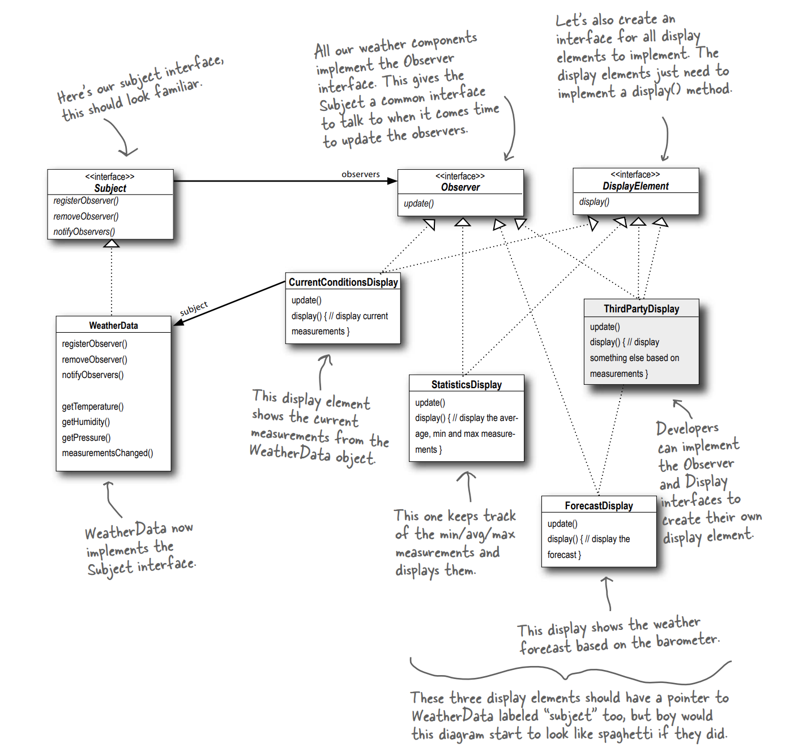

## Observer Pattern

### Problem Statement

#### Internet-based Weather Monitoring Station
There is a weather station that is based on a
WeatherData object, which tracks current weather conditions
(temperature, humidity, and barometric pressure). Weʼd like
for you to create an application that initially provides three
display elements: current conditions, weather statistics and a
simple forecast, all updated in real time as the WeatherData
object acquires the most recent measurements.

Further, this is an expandable weather station. We want to release an API so that other developers can
write their own weather displays and plug them right in. Weʼd
like for you to supply that API!

### Observer design pattern

The Observer Pattern defines a one-to-many
dependency between objects so that when one
object changes state, all of its dependents are
notified and updated automatically.

The Observer Pattern provides an object design where subjects and observers are loosely coupled.
When two objects are loosely coupled, they can interact,
but have very little knowledge of each other. 

#### Why loosely coupled?

* The only thing the subject knows about an observer is that it
  implements a certain interface.
* We can add new observers at any time. 
* We never need to modify the subject to add new types of observers.
* We can reuse subjects or observers independently of each other.
* Changes to either the subject or an observer will not affect the other. 

> Loosely coupled designs allow us to build flexible OO
systems that can handle change because they minimize
the interdependency between objects.

### Solution Design

